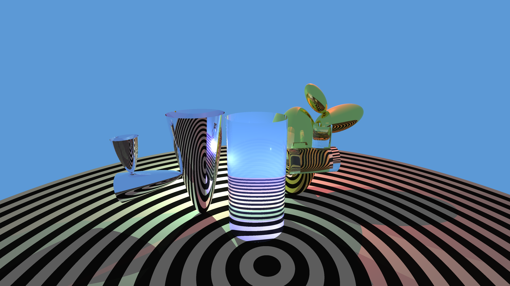

OpenGL-Raytracer-Cactus
===========================

Raytracing homework.

 [][Rendered video]
 [Rendered video]
 [Rendered video]: http://www.youtube.com/watch?v=4Q14RlkWwX0

Feladat
------------
Készítsen csendéletet,
ahol **procedurálisan textúrázott**, diffúz+Blinn spekuláris **asztalon**

egy **ellipszoid** aranykaktusz,

egy **paraboloid** ezüstkaktusz

és egy **henger** üvegkaktusz áll (a háromból min. kettő megvalósítása szükséges).

A kaktuszokból a törzsből a törzzsel hasonló, de kisebb részek nőnek ki,
mindig a felületre merőlegesen, legalább két további szinten
(az összes részek számát úgy kell megválasztani, hogy a program 1 percen belül lefusson).
A kinövő részek véletlenszerűen, nagyjából egyenletesen oszlanak el a felületen.

A teret egy *zöldes*, egy *kékes*, és egy *pirosas* pontfényforrás világítja meg,
a megvilágítási intenzitás a *távolság négyzetével csökken*.

Az égbolt világoskék.

Árnyékok vannak.

A kamera az asztal fölött van és enyhén lefelé néz.

...................r..........g..........b

Üveg (n/k)......1.5/0.0, 1.5/0.0, 1.5/0.0

Arany (n/k).....0.17/3.1, 0.35/2.7, 1.5/1.9

Ezüst (n/k).....0.14/4.1, 0.16/2.3, 0.13/3.1

Beadási határidő: 2014. 11. 09. 23:59
